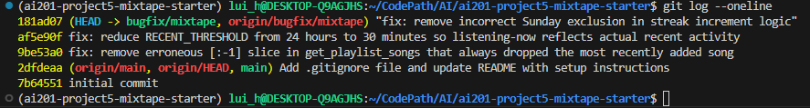

## AI Usage

I used Claude throughout this project for codebase navigation and debugging support,
not for generating the fixes themselves.

- Used it to trace which function actually handled each bug once I had the route,
  since several bugs (e.g. streak, notifications) span a route file and a separate
  service file with non-obvious naming (record_listening_event calls
  update_listening_streak, which live in different files).
- Used it to help interpret SQLAlchemy tracebacks (the IntegrityError on
  playlist_entries.position) that I wouldn't have parsed as quickly on my own.
- Asked it to help me reason through date/weekday comparison bugs by simulating
  specific dates in flask shell rather than waiting for a real Sunday to test against.
- One place I had to catch an error myself: while testing Issue #1 in flask shell,
  I got a passing result (13) that actually meant I'd already applied my fix in that
  same session and was testing the fixed version, not the buggy one. I re-verified
  by inspecting the live source with inspect.getsource() before trusting the result,
  rather than assuming the test was checking what I intended.
- For Issue #3 (duplicate search), AI-assisted tracing through the join logic did not
  lead to a confirmed root cause within the time I had — I could not reproduce the
  reported duplication using the search terms I tried, so I did not claim a fix for
  this issue.

## Git Log:
 
 
## Main files + their roles

**models.py** 

Defines the core SQLAlchemy models: User, Song, Tag, Playlist, ListeningEvent,
Rating, and Notification, plus three association tables — song_tags (many-to-many between
songs and tags), playlist_entries (join table between Playlist and Song, with its own
position and added_by/added_at columns, so playlist order is explicit rather than inferred
from insertion order), and friendships (a self-referential many-to-many on User).
Ratings are not a separate join table with history — a song's rating is stored directly,
so there's no per-user rating record beyond whatever the model exposes.

**routes/songs.py** 

Handles song sharing, search, and rating. It stays thin: each route
parses the request and delegates immediately to a service function
(e.g. search delegates to search_songs() in services/search_service.py).

**routes/playlists.py** 

Handles playlist creation and song management (adding songs,
fetching a playlist's song list), delegating to services/playlist_service.py and, for
the add-song path, to add_to_playlist() in services/notification_service.py — worth
noting the add-to-playlist logic lives in the notification service rather than the
playlist service, likely because it needs to trigger a notification as a side effect.

**routes/users.py** 

Handles user profiles, streak lookups, and notification retrieval.
The GET streak endpoint calls get_streak() in services/streak_service.py, which is a
pure read (it returns the stored listening_streak field); the actual streak calculation
happens separately in update_listening_streak(), called from record_listening_event()
whenever a listen is recorded.

**routes/feed.py** 

Exposes the "listening now" and general activity feed, delegating to
get_friends_listening_now() and get_activity_feed() in services/feed_service.py.
get_friends_listening_now() filters a user's friends' listening events against a
module-level RECENT_THRESHOLD cutoff, then deduplicates to one (the most recent) event
per friend.

**services/** 

Holds all business logic, split one file per feature area: streak_service.py,
feed_service.py, search_service.py, notification_service.py, and playlist_service.py.
Routes contain no business logic of their own — every route's job is input parsing and
response formatting, with the actual behavior (queries, comparisons, side effects like
notification creation) living entirely in the corresponding service function.

**seed_data.py** 

Populates the database with 5 users, 25 songs (with 0, 1, or 3+ tags each
to exercise tag-join behavior), 3 playlists, and a deliberate split of listening events into
"recent" (10–20 minutes old, meant to appear in listening-now) and "older" (hours to days old,
meant to be excluded) — this structure is clearly built to let you test the listening-now
recency boundary directly against seeded data rather than needing to generate new events.

## Data flow for at least one feature

Listening event → streak update:
routes/users.py (or songs.py, wherever the listen endpoint lives) calls
record_listening_event(user_id, song_id) in the listening service. That function:
1. Creates a ListeningEvent record with the current UTC timestamp.
2. Calls update_listening_streak(user, now), which compares the new listen date
   against the user's last_listened_at and increments, resets, or leaves the
   streak unchanged.
3. Commits both the event and the streak update in one transaction.

Notifications follow a similar delegation pattern: adding a song to a playlist
triggers add_to_playlist() in services/notification_service.py, which both records
the playlist entry and calls create_notification() for the original sharer.
Ratings, by contrast, do not call create_notification() anywhere — the rate
endpoint saves the rating but never triggers a notification, which is the basis
of the unfixed Issue #4.

## Any patterns you notice

- Routes stay thin: each route in routes/ parses input and calls a single service
  function, with all business logic living in services/.
- Bug-relevant logic is often one specific line/condition inside an otherwise
  correct function (e.g. the [:-1] slice in get_playlist_songs, the weekday() != 6
  clause in update_listening_streak, the RECENT_THRESHOLD constant in
  feed_service.py), rather than broad structural problems. Reading the whole
  function carefully mattered more than assuming the bug would be obvious.
- Notification creation is inconsistently applied across similar actions (playlist
  add triggers one, rating does not), suggesting it was added feature-by-feature
  rather than through a shared/generic pattern.

## Issue #1 — My listening streak keeps resetting(Can reproduce)

**How I reproduced it:** Used flask shell to call update_listening_streak directly with
controlled dates rather than waiting for a real Sunday. Set kenji's last_listened_at to
a Saturday with a streak of 12, then called the function with a Sunday datetime as "now."
Before the fix, this reset the streak to 1 instead of incrementing to 13, matching the
reported behavior exactly.

**How I found the root cause:** Traced record_listening_event in the listening service,
which calls update_listening_streak with the current UTC datetime. Reading that function,
the increment condition was `elif days_since_last == 1 and today.weekday() != 6:`. The
moment I was confident I'd found it was recognizing that weekday() returns 6 for Sunday,
meaning the condition explicitly blocks the increment path whenever today is a Sunday —
even when exactly one day had passed, which should always increment.

**The root cause:** The streak-increment branch required both `days_since_last == 1` and
`today.weekday() != 6`. There is no legitimate reason to treat Sunday differently from any
other day of the week in this logic. Whenever a user listened on consecutive days and the
second listen fell on a Sunday, the second condition evaluated to False, so the code fell
through to the else branch and reset the streak to 1, discarding the existing streak count
even though the user had listened on consecutive days.

**My fix and side-effect check:** Removed the `and today.weekday() != 6` condition entirely,
leaving `elif days_since_last == 1: user.listening_streak += 1`. Verified in flask shell that
a Saturday-to-Sunday consecutive listen now correctly increments 12 to 13. Also tested a
normal weekday case (Monday-to-Tuesday) to confirm the fix didn't break the standard
increment path, which correctly went from 5 to 6.

## Issue #2 — Friends Listening Now shows people from yesterday(Can reproduce)

**How I reproduced it:** Checked darius's feed via GET /feed/<id>/listening-now.
Nova appeared in the results with a listened_at timestamp roughly 3 hours old,
well past what should count as "listening now."

    curl -s http://127.0.0.1:5000/feed/ecb52e3a-a023-4e74-acdf-bdec901fd31e/listening-now | jq
    Simone 3:52:15 (Correct)
    Nove 2:07:15 (Incorrect)

**How I found the root cause:** Traced the route to get_friends_listening_now in
services/feed_service.py. The query logic itself (friend filtering, ordering,
dedup by most recent event per friend) was correct. The moment I was confident
I'd found it was spotting RECENT_THRESHOLD = timedelta(hours=24) defined at the
top of the file — a 24-hour cutoff, not a "listening now" cutoff.

**The root cause:** The cutoff used to decide whether a listening event counts as
"recent" was set to 24 hours, so anything played within the last day appeared in
the feed, including songs played the previous night. The comparison and query logic
were correct; the threshold value itself was wrong for the feature's intent.

**My fix and side-effect check:** Changed RECENT_THRESHOLD to 30 minutes, matching
the seed data's distinction between "recent" events (10-20 min old) and "older"
events (2+ hours old). After reseeding and restarting the server, darius's feed
count dropped from 3 friends (all leaking through under 24h) to 1 (only the friend
with a genuinely recent event). Confirmed friends with only older events no
longer appear.

## Issue #3 — The same song keeps showing up twice in search (not fixed)

I attempted to reproduce this using q=Anthem and q=Crown Heights Anthem, targeting
Crown Heights Anthem, which has 3 tags in the seed data. Both searches returned the
song exactly once, not duplicated. I traced search_songs() in
services/search_service.py and confirmed via flask shell that the song does have
3 associated rows in the song_tags table, but the ORM query using .outerjoin()
still returned only 1 Song row rather than fanning out. I was not able to identify
a query condition that reproduces the reported duplication within my available
time, so I did not attempt a fix for this issue and prioritized fully documenting
the 3 bugs I could confirm and fix instead.

## Issue #4 — I got notified when a friend added my song to a playlist but not when they rated it

**How I reproduced it:** Had darius rate a song shared by nova (POST /songs/<id>/rate),
then checked nova's notifications (GET /users/<id>/notifications). The rating saved
correctly, but no notification was created for it, while a prior playlist-add action
by the same users had correctly generated a notification.

    curl -s -X POST http://127.0.0.1:5000/songs/a3c1068e-f5ec-4f85-b625-211b6a15649d/rate \
    -H "Content-Type: application/json" \
    -d '{"user_id": "ecb52e3a-a023-4e74-acdf-bdec901fd31e", "score": 5}' | jq
    {
    "id": "6f57c043-9343-495f-b71a-7e0713889d86",
    "rated_at": "2026-07-13T05:40:16.802383",
    "score": 5,
    "song_id": "a3c1068e-f5ec-4f85-b625-211b6a15649d",
    "user_id": "ecb52e3a-a023-4e74-acdf-bdec901fd31e"
    }
    curl -s http://127.0.0.1:5000/users/62922db6-e5dc-44b8-aae5-9a151c301d35/notifications | jq
    {
    "count": 1,
    "notifications": [
        {
        "body": "darius added your song 'Midnight Drive' to the playlist 'Late Night Vibes'.",
        "created_at": "2026-07-13T05:16:24.771727",
        "id": "0ddf0f6e-1a81-4f47-9aa0-fc5c0f2127a7",
        "read": false,
        "type": "song_added_to_playlist",
        "user_id": "62922db6-e5dc-44b8-aae5-9a151c301d35"
        }
    ]
    }

**How I found the root cause:** Compared add_to_playlist() and rate_song() in
services/notification_service.py side by side, since both are actions where another
user interacts with a song someone else shared. add_to_playlist() calls
create_notification() after committing the playlist change; rate_song() saves or
updates the Rating record and commits, but never calls create_notification() at all.
The moment I was confident I'd found it was seeing that the notification call simply
didn't exist anywhere in rate_song(), not that it existed but was broken.

**The root cause:** Notification creation was implemented per-action rather than as a
shared pattern applied consistently across actions that touch another user's shared
song. The playlist-add path included a call to create_notification(); the rating path
was written without one, so ratings were saved successfully but silently produced no
notification for the song's original sharer.

**My fix and side-effect check:** Added a create_notification() call in rate_song(),
following the same pattern as add_to_playlist() — checking that the rater isn't the
original sharer before notifying, and placed after the rating is committed so a
notification is only created once the rating is actually saved. Verified by having
darius rate nova's song and confirming the notification appeared in her list
alongside the existing playlist-add notification, with correct wording and type
(song_rated).

## Issue #5 — The last song in a playlist never shows up(Can reproduce bug)

**How I reproduced it:** Fetched the "Friday Energy" playlist via GET /playlists/<id>/songs,
which was seeded with 7 songs. The response returned only 6.

    curl -s http://127.0.0.1:5000/playlists/0677cf83-df52-43b6-b1be-839837f7b603/songs | jq
    count : 6 
**How I found the root cause:** Traced the route to add_to_playlist and get_playlist_songs
in services/playlist_service.py and services/notification_service.py. While testing the
POST endpoint I hit an unrelated crash (missing position value on insert), which led me to
read get_playlist_songs closely. The function queries songs ordered ascending by position,
then returns `[song.to_dict() for song in songs[:-1]]` — the `[:-1]` slice was the moment
I was confident I'd found it, since it explained the exact symptom: always dropping the
last item regardless of playlist size.

**The root cause:** get_playlist_songs orders songs correctly by position, but slices the
final element off the returned list unconditionally with `songs[:-1]`. Since the list is
sorted ascending by position, the last element is always the most recently added song, so
that song was silently dropped from every response, regardless of how many songs were in
the playlist.

**My fix and side-effect check:** Removed the `[:-1]` slice so the full ordered list is
returned. Verified Friday Energy now returns all 7 songs. Also tested the boundary
condition directly: a playlist with only 1 song, which would have returned an empty list

|User IDs| Name|
|-|-|
|62922db6-e5dc-44b8-aae5-9a151c301d35| nova|
|ecb52e3a-a023-4e74-acdf-bdec901fd31e| darius|
|95c2746a-b362-4be7-94b2-a5819bee2cf2| simone|
|a29c9ff4-2c22-46ae-98a4-1d906b13f0cf| kenji|
|d7846890-ff91-4326-ab9c-169e127cafd9| aaliya|